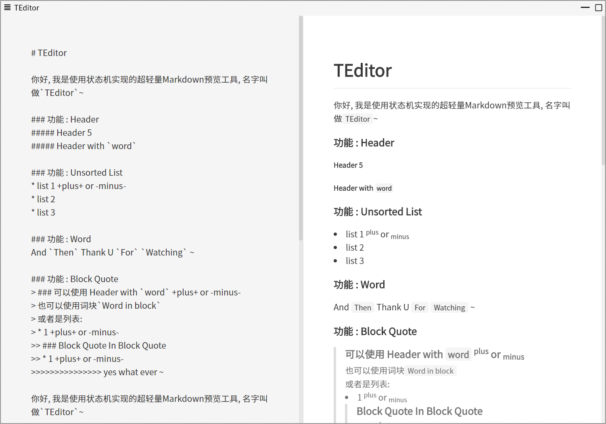

# 从一个越写越慢的编辑器中聊聊优化思路

你用过一个`越写越慢的编辑器`么?

某年某月我在我的博客项目中实现了一个MD编辑器, 不过性能令人捉急. 当时用了简单的一种实现方式, 由于没有在解析过程中使用缓存结构进行性能优化, 导致当正在写的文章变长之后, 编辑器会变得非常~非常~卡, 所以说是越写越慢的编辑器( ╯□╰ ) 这期文章主要针对这个编辑器聊聊我实践以及思考总结的一些性能优化方法, 同时欢迎各路大佬留言评论, 不舍赐教.



## 解析过程简述

一般来说MD的解析器不过词法语法分析阶段, 而且标点符号几乎没有二义性, 所以对于一段简单的MD文本, 我们大可从一个正则表达式的角度入手. 思考如下过程:

1. 块状固定关键字, 如`[TOC]`,`---`(水平分割线)等
2. 解析块状元素, 如`>`(引用), 代码段等
3. 解析文本元素, 主要区分行文本(标题, 列表)和普通文本流
4. 解析行内元素, 如角标(<sup>上标</sup><sub>下标</sub>)

见下MD代码, 我们按照1-4的过程对原始内容进行解析:

```markdown
### 标题<sup>上标</sup>
1. list 1
2. list 2
\`\`\`markdown
### 标题+2+
\`\`\`
```

第一行, 非关键字, 非块状元素, 命中文本元素标题, 那么处理标题这段内容:

```markdown
### 标题<sup>上标</sup>
```

在这段内容中, 我们还要继续解析比文本元素优先级更低的行内元素, 命中角标:

```markdown
### <sup>上标</sup>
```

至此, 我们将所有解析完的内容推入结果数组, 并将此标题内容从原始内容中移除, 再继续按照1-4的思路解析剩余部分, 直到原始内容为空时, 将结果数组整理并返回.

## 解析函数节流

函数节流是老生常谈的话题了, 当然不能当左侧内容一有变动就立即更新. 在一些极端的场合, 比如长按删除或是长按空格回车等情况下, 解析函数执行的压力以及浏览器对解析函数输出内容的渲染对CPU而言是相当沉重的负担. 所以我们优化思路首先要求尽可能少的使浏览器重新渲染页面.

目标有了, 那么对应的解决方案手到擒来:

1. 对特定类型按键, 我们将不调用解析函数, 如多个连续的空格回车或是某些行内符号. 因为这些内容的解析结果对之预览结果没有影响
2. 对解析函数节流, 将调用频率控制在0.3秒1次, 具体的数值可根据个人需求调整, 比如我常常在回车后习惯性扫一眼预览, 那么按回车后可以跳过节流立即执行一次解析

## 缓存解析结果

缓存解析结果方案, 类似于常见算法题中的备忘录对象. 比如我们要实现一个斐波那契数列的递归函数, 计算`fabi(5)`时需要用到`fabi(3)`和`fabi(4)`的结果, 我们可以尝试从一个缓存对象中获取`fabi(3)`的结果, 如果其已经计算过则不用再次计算了. 推导到我们的解析器, 同样可以创建一个备忘录对象去缓存解析结果.

### 备忘录实现

一开始写解析结果缓存的时候, 笔者在这犯了一个很严重的错误, 那就是想尝试将所有内容以及其解析值缓存到备忘录对象, 如下代码所述:

```JS
data: {
  // 备忘录对象
  memo: {}
}
watch: {
  // 当编辑器的value变动时将尝试直接获取缓存, 如果没有缓存才解析内容
  value (n, o) {
    if (this.memo[n]) {
      this.parsedValue = this.memo[n]
    } else {
      this.memo[n] = this.parsedValue = parseMDToHTML(n)
    }
  }
}
```

代码看起来没什么问题, 因为问题不在代码, 而在内存容量上. 代码运行在浏览器中时, 一般情况下, 内存相对于代码执行速度而言是比较廉价的, 所以备忘录这种`以空间换时间`的代码模式经常使用到, 而且通常还非常好用. 然而这可能带来一个问题, 它使得前端对内存的感知非常有限————因为笔者将整个编辑区域的原始值作为对象的键, 将其解析结果作为值缓存下来————一旦文章长度开始增长, 备忘录对内存的占用将急剧增大.

假设我们有某文章字符长度总量为n, 那么备忘录模型将生长成这个样子:

```JS
value = '12345...n'
value.length === n // true
memo == {
  1,
  2,
  // ...
  n-1,
  n
}
```

那么可以轻易得出, 文章字符长度(n)和内存消耗(o)的关系形如:

$$o = n(n+1)/2$$

和你想的一样, 笔者浏览器内存爆了😅

不仅如此, 文章不断地增长, 不仅带来内存压力, parseMDToHTML函数每次要处理地内容也变多, 浏览器响应速度也越来越慢.

我们需要更好地解决方案.

### LRU 以及 LFU 策略

在解析过程简述小节, 我们提到解析器在解析时, 会将MD文本拆分为块状内容进行解析. 由此我们可以尝试缓存块状内容的解析结果到一个全局对象中, 节约CPU算力.

## 拆分解析内容